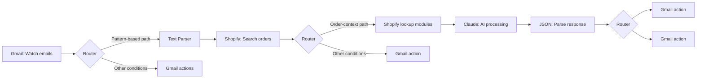

# Make.com: Gmail Routing with Shopify Context and Claude

**Type:** Workflow architecture case study  
**Tools visible in the scenario:** Make.com, Gmail, Text Parser, Shopify, Anthropic Claude, JSON

## Overview

This documents a Make.com scenario that processes incoming Gmail messages, routes different cases, retrieves Shopify order context where needed, uses Claude for an AI processing step, parses a JSON response, and routes to Gmail follow-up actions.

It is a walkthrough of an existing scenario diagram, **not** a downloadable blueprint, a claim of active production deployment, or a report of client performance metrics.

## Workflow outline

The diagram intentionally simplifies some branches; it is an architecture overview rather than an exact Make export.

## Technical elements demonstrated by the scenario

- Monitoring Gmail messages as an automation trigger.
- Routing messages through conditions, including a text-parsing path.
- Looking up Shopify information to supply context to a later step.
- Using Anthropic Claude as an AI processing module.
- Parsing the resulting JSON and branching to Gmail actions.

## Implementation considerations

For any deployment of this pattern, I would separately verify input parsing, missing-order handling, JSON schema validation, idempotent email actions, error logging, retries, and test cases. These are recommended checks; they are **not represented as verified features or measured outcomes** of the pictured scenario.

## Privacy and evidence

This summary excludes account IDs, scenario URLs, credentials, customer information, and confidential payloads. A runnable blueprint is not included because the original scenario export and configuration are not part of this public document.

---

**Portfolio:** [Muhammad Ahmad — GitHub profile](https://github.com/ahmadyaseen1080)  
**Upwork:** [View profile](https://www.upwork.com/freelancers/muhammadahmad38)
